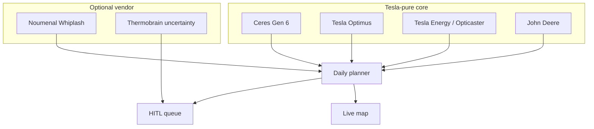

# Architecture

```mermaid
flowchart TD
  subgraph core [Tesla-pure core]
    Ceres[Ceres Gen 6]
    Opt[Tesla Optimus]
    Eng[Tesla Energy / Opticaster]
    JD[John Deere]
  end
  subgraph optional [Optional vendor]
    Whip[Noumenal Whiplash]
    Thermo[Thermobrain uncertainty]
  end
  Planner[Daily planner]
  HITL[HITL queue]
  Map[Live map]
  Ceres --> Planner
  Opt --> Planner
  Eng --> Planner
  JD --> Planner
  Whip --> Planner
  Thermo --> HITL
  Planner --> HITL
  Planner --> Map
```

Whiplash is ingested as `vendor:whiplash:<id>` tasks. Agents that may emit those tasks: Grazing / Carbon and Operations Synthesis only.
